# Tic-Tac-Toe RL Project

This repository contains an educational and experimental tic-tac-toe environment plus a set of reinforcement-learning (RL) agents (using REINFORCE, PPO, and random search). The project is not meant for production-level game AI but rather to explore and experiment with RL techniques in a simple environment.

## Overview

### Flask Web App:
- Lets you train a tic-tac-toe agent using different algorithms (Random Search, REINFORCE, PPO)
- You can specify hyperparameters (learning rate, gamma, steps) and choose the opponent type (random, self-play, co-play)
- The trained agent (O) can then be tested interactively via a browser

### Hyperparameter Sweeps:
- Standalone Python scripts (`hyperparam_sweep.py`, `hyperparam_sweep_coplay.py`)
- Systematically vary parameters (lr, gamma, hidden-layer sizes)
- Produce charts of training performance for educational analysis

### RL Agents:
- **Random Search**: Baseline approach, no real learning
- **REINFORCE**: Policy gradient with optional entropy bonus
- **PPO**: More advanced policy gradient approach
- **"co-play" variant**: Trains two separate agents X and O simultaneously, each with its own policy and updates

## Observations & Insights

### 1. Training Against a Random Opponent
If you train the model against a randomly choosing opponent, its accuracy will continue to climb and reach quite high. What you observe when you play against it, however, is that while it knows how to win, and will do so if you move randomly, it has no idea how to *prevent you* from winning, and we always go first, we can win almost every time.

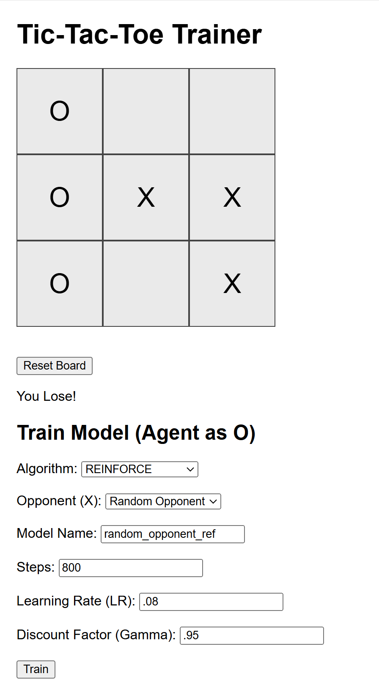


### 2. Training Against Itself (Self-Play)
Of course, when we train it against itself, it is much better at preventing you from winning. But it still fails. Now, perfect play in tictactoe of course results in a draw every time, and training seems to stall at around ~45% win rates. So something isn't working here.

But then I thought of a major issue. Now, while waiting for the hyperparameter sweep to finish, I came across a strange idea: when the model trains against a bot with the same policies, it's actually incentivized to *lose* in a very particular way. Because if its generated policy is so bad on specifically off-turns that it loses, that actually rewards the model we are training. *We're basically training it to win on even turns and lose on odd ones, not just to win.*

Therefore we should try this solution: we train two distinct models at once. That way, its policy set is simply never rewarded for losing. They call it "co-play."

### 3. Hyperparameter Analysis (Self-Play)
First, let's look at the charts though.

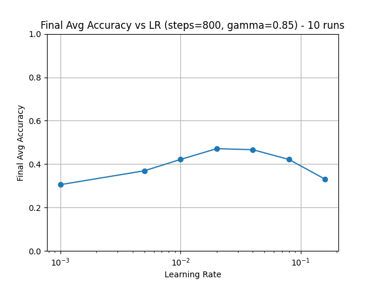
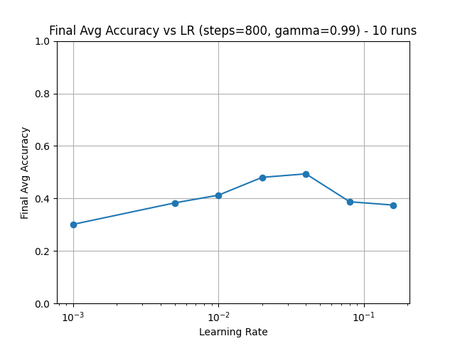

We see gamma had little effect on the best learning rate for 800 steps, and that the best learning rate for these two gamma values seemed to be about .08, peaking at ~.5 win rate.

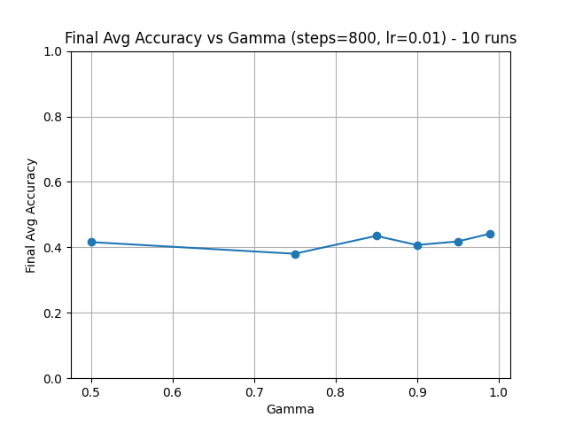
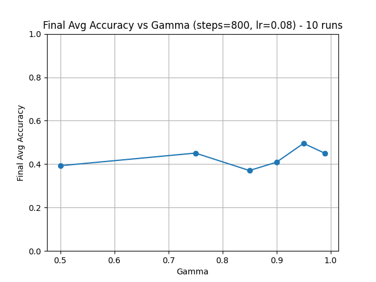

We see that at learning rate .001, gamma mostly made no difference and win rate was hampered. But with .008, we got a competitive win rate of .5 with a gamma of .95. 

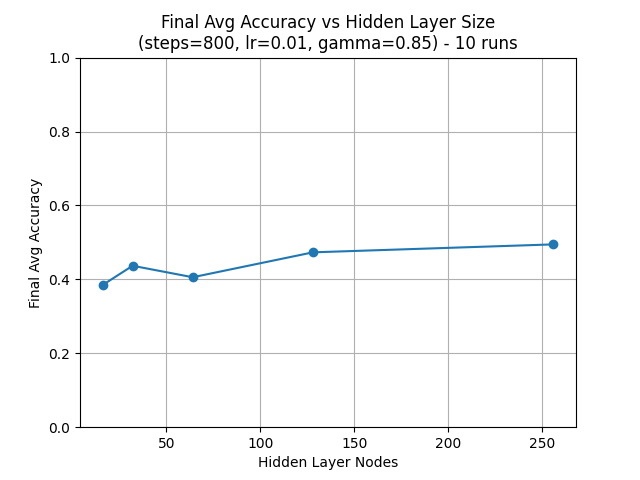

As one could predict, we increasing the size of the hidden layer generally improved the model, though with diminishing returns.

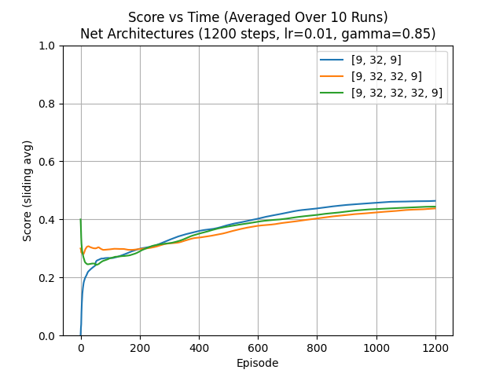

Interestingly, the number of layers had little affect overall, and if anything seemed only to reduce the performance.

### 4. Co-Play (Training Two Distinct Models)
- Train two distinct agents, X and O, in one environment
- Each agent has its own policy network, log probs, and updates
- Helps avoid the "policy sabotage" issue
- In practice (especially in small, zero-sum games), you may see instabilities or collapses in training

While our objective function may have become closer aligned with winning tic-tac-toe, co-play seemed to induce model collapse. I tried varying the optimizer from adam to SGD, in case adam was sending the learning rate too dommedly low levels, and this helped some, but still mostly led to collapse.

Adam:
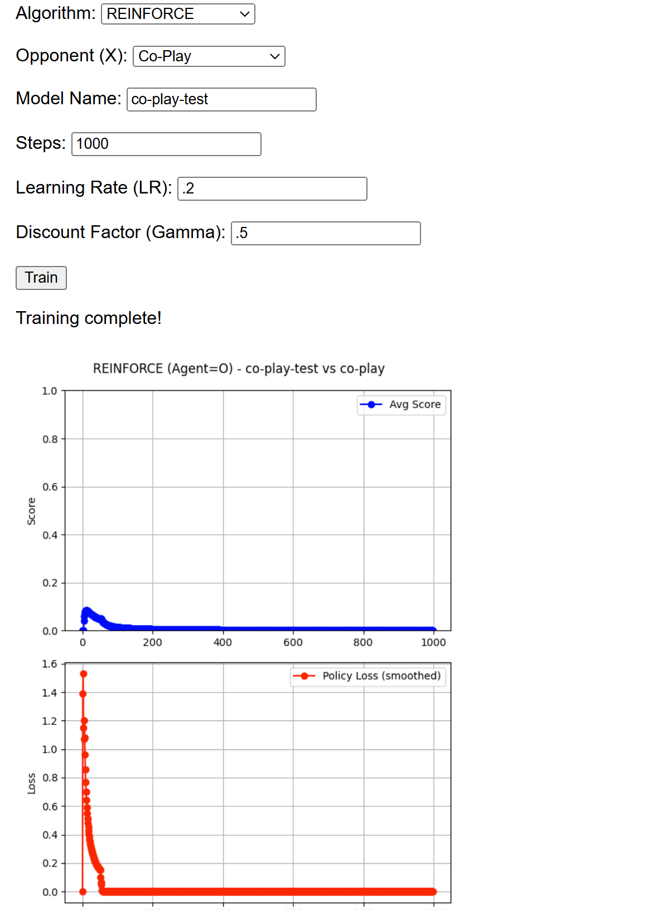
SGD:
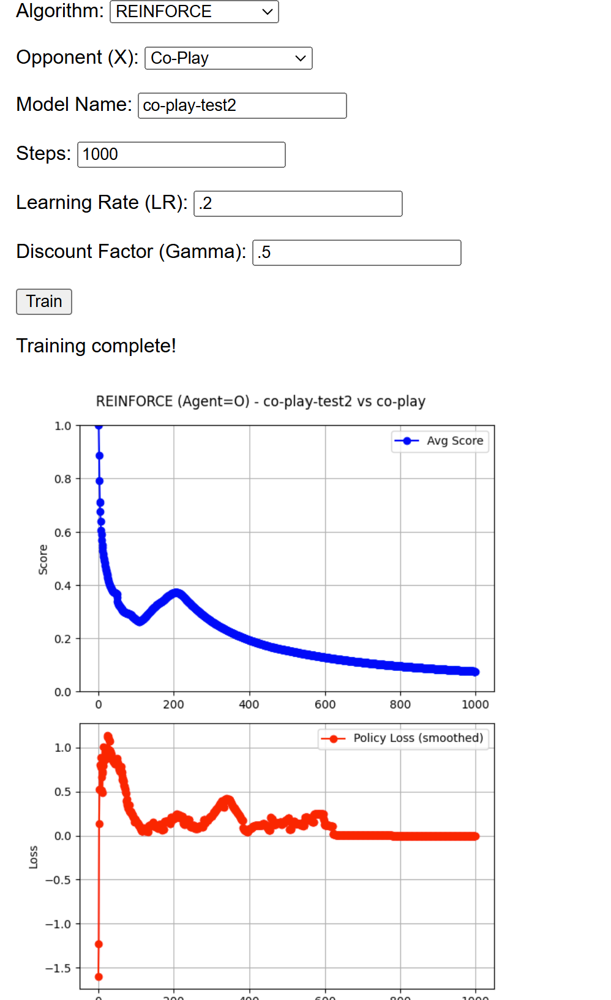

Likewise, hyperparameter plots were significantly worse
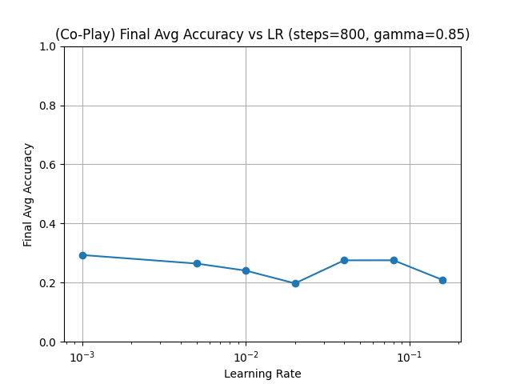
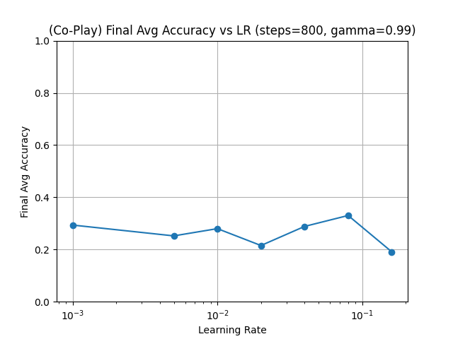
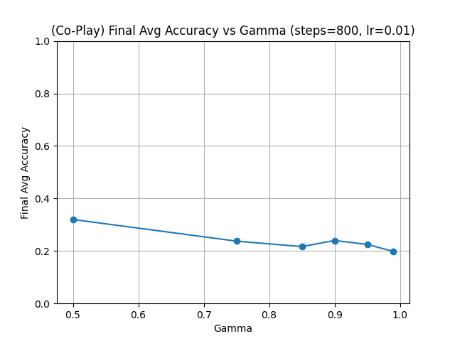

## Educational Takeaways
- Simple RL Agents in a small game can produce interesting behaviors but quickly hit fundamental limits
- Self-Play vs. Co-Play demonstrates how multi-agent incentives can cause complicated reward dynamics
- Entropy Bonus helps exploration but doesn't solve fundamental problems
- Batch-based policy updates and advanced multi-agent RL methods can improve learning stability

## Disclaimer
This project is primarily for learning and experimentation. The code is not optimized or guaranteed to converge on "perfect play." For a deeper or more stable multi-agent approach, consider:
- Larger batch rollouts
- Multi-epoch policy updates (common in PPO)
- Techniques specifically designed for multi-agent zero-sum scenarios

## Folder Structure
```
app.py                      # Flask server that hosts the tic-tac-toe web interface
templates/
  └── index.html           # Front-end page with training forms, board
static/scripts/
  └── tictactoe.js         # Client-side JavaScript for user interaction
utils/
  ├── tic_tac_toe.py       # Tic-tac-toe environment logic
  └── plot.py              # Plotting helpers for training graphs
models/
  ├── random_search.py
  ├── reinforce.py         # with optional entropy
  └── ppo.py
training/
  └── train.py            # Orchestrates which model to train
```

## Future Work
- **Batching Episodes**: Collect multiple episodes before updates
- **Replay Buffers**: Accumulate experiences from both agents
- **Self-Play Enhancements**: Maintain historical "best" snapshots
- **Exploration**: Tune entropy_coef or add sophisticated exploration
- **More Complex Environments**: Move beyond tic-tac-toe's limitations
